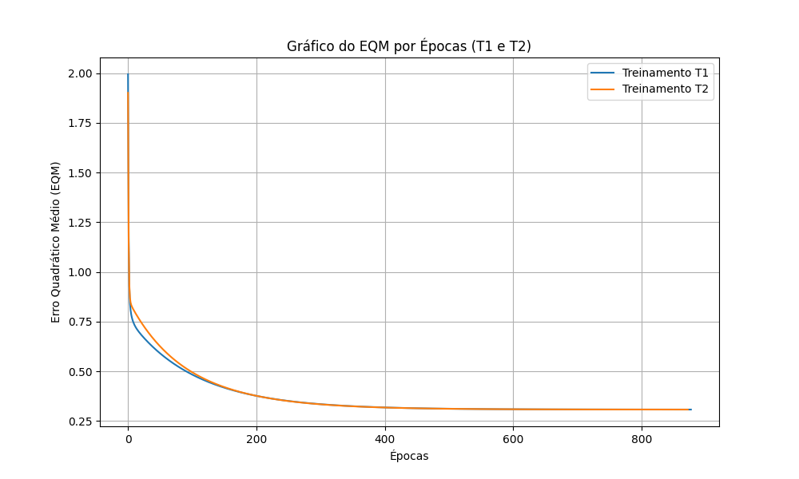

# Resultados da Rede Adaline

## Tabela de Treinamentos

| Treinamento | Número de Épocas | Vetor de Pesos Inicial (w0, w1, w2, w3, w4) | Vetor de Pesos Final (w0, w1, w2, w3, w4) |
|---|---|---|---|
| T1 | 878 | [0.3745, 0.9507, 0.7320, 0.5987, 0.1560] | [-1.8114, 1.3126, 1.6415, -0.4263, -1.1772] |
| T2 | 873 | [0.1151, 0.6091, 0.1334, 0.2406, 0.3271] | [-1.8114, 1.3125, 1.6414, -0.4266, -1.1771] |
| T3 | 903 | [0.8348, 0.1048, 0.7446, 0.3605, 0.3593] | [-1.8113, 1.3126, 1.6414, -0.4264, -1.1771] |
| T4 | 910 | [0.9890, 0.5495, 0.2814, 0.0773, 0.4445] | [-1.8113, 1.3126, 1.6414, -0.4264, -1.1771] |
| T5 | 921 | [0.7838, 0.6348, 0.2490, 0.7581, 0.3131] | [-1.8113, 1.3126, 1.6415, -0.4263, -1.1772] |

## Gráfico de EQM

## Tabela de Classificação das Amostras de Teste

| Amostra | x1 | x2 | x3 | x4 | y (T1) | y (T2) | y (T3) | y (T4) | y (T5) | Classificação Final (Válvula) |
|---|---|---|---|---|---|---|---|---|---|---|
| 1 | 0.9694 | 0.6909 | 0.4334 | 3.4965 | -1 | -1 | -1 | -1 | -1 | A |
| 2 | 0.5427 | 1.3832 | 0.6390 | 4.0352 | -1 | -1 | -1 | -1 | -1 | A |
| 3 | 0.6081 | -0.9196 | 0.5925 | 0.1016 | 1 | 1 | 1 | 1 | 1 | B |
| 4 | -0.1618 | 0.4694 | 0.2030 | 3.0117 | -1 | -1 | -1 | -1 | -1 | A |
| 5 | 0.1870 | -0.2578 | 0.6124 | 1.7749 | -1 | -1 | -1 | -1 | -1 | A |
| 6 | 0.4891 | -0.5276 | 0.4378 | 0.6439 | 1 | 1 | 1 | 1 | 1 | B |
| 7 | 0.3777 | 2.0149 | 0.7423 | 3.3932 | 1 | 1 | 1 | 1 | 1 | B |
| 8 | 1.1498 | -0.4067 | 0.2469 | 1.5866 | 1 | 1 | 1 | 1 | 1 | B |
| 9 | 0.9325 | 1.0950 | 1.0359 | 3.3591 | 1 | 1 | 1 | 1 | 1 | B |
| 10 | 0.5060 | 1.3317 | 0.9222 | 3.7174 | -1 | -1 | -1 | -1 | -1 | A |
| 11 | 0.0497 | -2.0656 | 0.6124 | -0.6585 | -1 | -1 | -1 | -1 | -1 | A |
| 12 | 0.4004 | 3.5369 | 0.9766 | 5.3532 | 1 | 1 | 1 | 1 | 1 | B |
| 13 | -0.1874 | 1.3343 | 0.5374 | 3.2189 | -1 | -1 | -1 | -1 | -1 | A |
| 14 | 0.5060 | 1.3317 | 0.9222 | 3.7174 | -1 | -1 | -1 | -1 | -1 | A |
| 15 | 1.6375 | -0.7911 | 0.7537 | 0.5515 | 1 | 1 | 1 | 1 | 1 | B |

## Explicação sobre os Pesos Inalterados

**Embora o número de épocas de cada treinamento seja diferente, explique por que então os valores dos pesos continuam praticamente inalterados:**

A rede Adaline encontra um único ponto de mínimo global para o Erro Quadrático Médio (EQM) no espaço de pesos, uma vez que a superfície de erro para redes com funções de ativação lineares no cálculo do erro é um paraboloide (função quadrática convexa). Devido a esta característica, não existem mínimos locais. Independentemente do vetor de pesos inicial (aleatório), o algoritmo da Regra Delta guiado pela descida do gradiente convergirá sempre para o mesmo conjunto de pesos ótimo (ou muito próximo a ele, dada a tolerância/precisão). A diferença no número de épocas ocorre porque cada treinamento parte de um ponto inicial diferente no espaço de pesos, necessitando de mais ou menos iterações (épocas) para descer o gradiente e atingir o mínimo global com a tolerância de precisão exigida ($10^{-6}$).